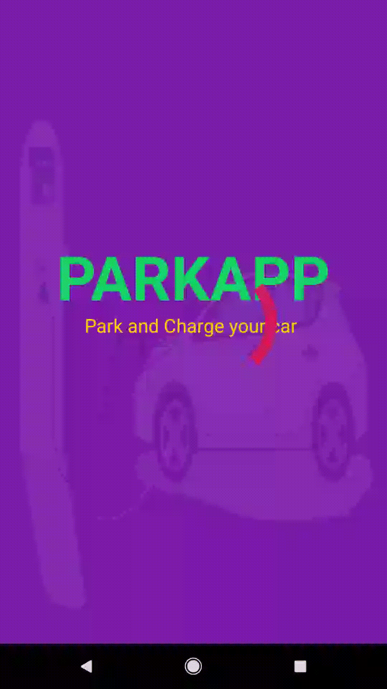

# parkApp

 

 

 

# Introduction
Android app for smart parking

this app will have the facility of finding a spot for charging a electric car,booking a spot for charging,payment for the service etc.

# Getting Started
first your start your firbase project and linked to your android and download the credentials json 
file from the firebase and save to local storage . Linked your credential json file path in 
the `credentialsFileLocation` variable in the firebase module available there .

Run `requirement.txt` to install the required python libraries 

Go to the `virtual-parkingLOT/jsonGenerator` and run `main.py` for the local API.

To run the backend system go to `backend/` and run `main.py` to initiate the backend system .

Go to your android app and do the rest of the work the UI will guide you what to do.

# Componenets 

## backend
  Find the backend in the `backend/` folder
  
## virtual environment
   Find the backend in the `virtual-parkingLOT/` folder

## android app
 find the android app in `asset/` folder

# Tecnology stack
- Android 
- firebase
- Python
- HTML
- CSS
- JavaScript

# Example Applets

